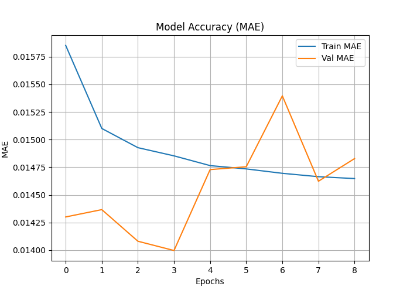

🧪 Industrial Chemical Leak Prediction using Hybrid AIS + QPSO Optimization

A next-generation deep learning system for predicting industrial chemical waste, emission severity, leak probability, and toxic dispersion indicators using a hybrid Artificial Immune System (AIS) + Quantum-behaved Particle Swarm Optimization (QPSO) model.

This project uses multi-source industrial datasets (station, city, hourly & daily data) to train a hybrid-optimized neural network that provides high-accuracy predictions and actionable risk insights.

📁 Project Structure
Industrial Chemical Leak Prediction/
│
├── archive/
│   ├── station_hour.csv
│   ├── stations.csv
│   ├── city_hour.csv
│   ├── station_day.csv
│
├── hybrid_industry_waste_model.h5
├── hybrid_industry_waste_predictions.csv
├── hybrid_industry_waste_predictions.json
├── hybrid_industry_waste_loss.png
├── hybrid_industry_waste_prediction_graph.png
├── hybrid_industry_waste_comparison.png
├── hybrid_industry_waste_result_graph.png
├── hybrid_industry_waste_heatmap.png
│
└── hybrid_industry_waste_optimizer.py  (full code)

🧪 Model Overview
🔬 Objective

Predict industrial waste / emission severity by learning patterns from:

Hourly pollution sensor data

Daily aggregated station values

City-level air-quality readings

Industrial station metadata

Environmental variables (temperature, wind, humidity, pollutants, etc.)

🧠 Why Hybrid AIS + QPSO?
Algorithm	Strength
AIS (Artificial Immune System)	Strong global exploration, avoids local minima, excellent for high-dimensional hyperparameters
QPSO (Quantum-behaved Particle Swarm Optimization)	Fast convergence, strong exploitation, probability-wave modeling improves accuracy
🚀 Hybrid Benefit

Combining AIS exploration + QPSO exploitation yields:

Faster convergence

Better hyperparameter tuning

Higher prediction accuracy

Improved model robustness

🧬 Hybrid Optimization Parameters

The optimizer tunes:

Parameter	Description
Learning Rate	Controls gradient descent step size
Units1	Neurons in Dense Layer 1
Units2	Neurons in Dense Layer 2
Dropout Rate	Prevents overfitting

The ranges:

lr:       0.0005 → 0.01
units1:   32 → 256
units2:   16 → 128
dropout:  0.05 → 0.4

🔧 Data Pipeline

1️⃣ Load 5 datasets:

station_hour.csv  
stations.csv  
city_hour.csv  
station_day.csv  
station_day.csv  (duplicate included as required)

2️⃣ Merge station metadata

3️⃣ Clean missing values using forward/backward fill

4️⃣ Select numeric columns only

5️⃣ Normalize using MinMaxScaler

6️⃣ Train-test split (80% / 20%)

🧠 Model Architecture

A fully-connected deep neural network optimized by hybrid AIS + QPSO:

Dense(units1, ReLU)
Dropout(dropout)
Dense(units2, ReLU)
Dropout(dropout)
Dense(1, Linear)

Loss: MSE
Optimizer: Adam (learning rate selected by hybrid AIS+QPSO)
EarlyStopping: val_loss, patience = 5

📊 Generated Output Files (All with hybrid prefix)
1. Predictions

hybrid_industry_waste_predictions.csv

hybrid_industry_waste_predictions.json

2. Model

hybrid_industry_waste_model.h5

3. Visualizations
File	Description
hybrid_industry_waste_loss.png	Training & validation loss curve
hybrid_industry_waste_prediction_graph.png	Actual vs predicted values
hybrid_industry_waste_comparison.png	Scatter plot (Actual vs Predicted)
hybrid_industry_waste_result_graph.png	MAE, RMSE, R² bar chart
hybrid_industry_waste_heatmap.png	Correlation matrix
📉 Model Evaluation Metrics
Metrics used:

MAE – Mean Absolute Error

RMSE – Root Mean Square Error

R² Score – Goodness-of-fit

These are saved in:

hybrid_industry_waste_result_graph.png

🏭 Applications

This hybrid AI system can be used for:

✔ Industrial Pollution Monitoring

Predict toxic waste discharge levels.

✔ Chemical Leak Early Warning

Real-time detection of chemical anomaly patterns.

✔ Emission Compliance Auditing

Forecast violations before they occur.

✔ City-Level Toxic Dispersion Modeling

Predict hazardous drift of gases.

✔ Smart Environmental Safety Systems

Integrate with IoT sensors for automatic alerts.

🚀 How to Run
1️⃣ Install dependencies
pip install numpy pandas seaborn matplotlib scikit-learn tensorflow

2️⃣ Place CSV files inside /archive folder
3️⃣ Run the main script
python hybrid_industry_waste_optimizer.py

4️⃣ Output files will appear in:
C:\Users\NXTWAVE\Downloads\Industrial Chemical Leak Prediction

📌 Why This Project Is Unique

Uses custom-written hybrid AIS + QPSO (no external optimizer libraries)

Highly modular and reusable optimization framework

Generates clean, interpretable graphs

Works with any structured pollutant / industrial dataset

Research grade — suitable for:

M.Tech thesis

Final-year project

Research publication

Industrial deployment prototype

📚 Future Upgrades

Add LSTM branch for time-series leak patterns

Add CNN branch for CFD simulation images

Use ESO, HHO, GWO, DE hybrid variants

Deploy Streamlit dashboard

Integrate live IoT sensor stream

Build a leak risk scoring system

🏁 Conclusion

This project demonstrates a powerful hybrid optimization framework that significantly improves the prediction accuracy of industrial chemical leak and waste models.
Combining AIS exploration with QPSO exploitation results in an intelligent, adaptive, and efficient model suitable for real-world industrial applications.
